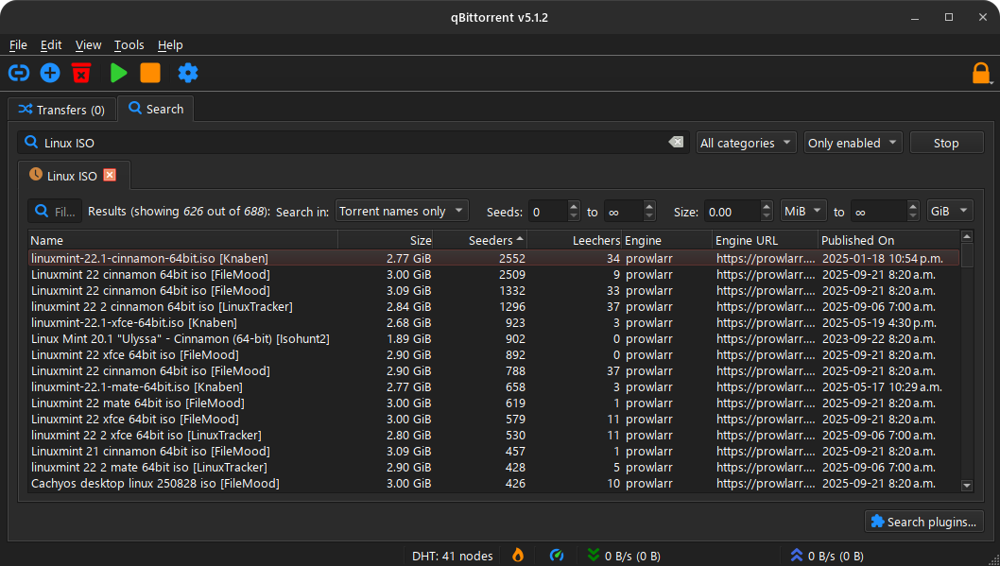

# 🔍 prowlarr-qbittorent-search

A plugin for [qBittorrent](https://www.qbittorrent.org/) that extends its built-in search capabilities by integrating [Prowlarr](https://prowlarr.com/) as a search engine. With this plugin, users can search Prowlarr trackers/indexers directly from the qBittorrent interface.


## 🚀 Features

- 🔎 **Multi-Threaded Search**: Query multiple trackers/indexers simultaneously
- 📦 **Category Filtering**: Filter results by categories like Movies, TV, Music, Games, and Software
- 🔐 **Proxy Support**: Route queries through the configured proxy for privacy
- 🧩 **Seamless Integration**: Works natively within the qBittorrent search tab


## 📸 Screenshots




## 🛠 Installation

1. Ensure you have Python installed (required for qBittorrent search plugins).
2. Download or clone this repository:
   ```bash
   git clone https://github.com/anon0mis/prowlarr-qbittorent-search.git
   ```
3. Copy the plugin file(s) (`prowlarr.py` is technically the only required file) to your qBittorrent search plugins directory:
   - **Linux**: `~/.local/share/data/qBittorrent/nova3/engines/` or `~/.local/share/qBittorrent/nova3/engines/` or `~/.var/app/org.qbittorrent.qBittorrent/data/qBittorrent/nova3/engines` if using Flatpak
   - **Windows**: `%LOCALAPPDATA%\qBittorrent\nova3\plugins\`
4. Edit the `prowlarr.json` file. (or restart qBittorrent to generate the default and edit it)
5. Restart qBittorrent and go to the **Search** tab.
6. Click **Search Engine > Install a new one** to verify plugin activation.

See [https://github.com/qbittorrent/search-plugins/wiki/Install-search-plugins](https://github.com/qbittorrent/search-plugins/wiki/Install-search-plugins) for detailed/alternative instructions.


## 🔧 Configuration

You can customize the plugin by editing the `prowlarr.json` file:

```json
{
    "api_key": "YOUR_API_KEY_HERE",
    "thread_count": 20,
    "tracker_first": false,
    "url": "http://127.0.0.1:9696",
    "result_limit": 500
}
```


### ⚙️ Configuration Options

| Key            | Default Value           | Description                                                                 |
|----------------|-------------------------|-----------------------------------------------------------------------------|
| `api_key`      | `YOUR_API_KEY_HERE`     | Your Prowlarr API Key                                                       |
| `thread_count` | `20`                    | Maximum number of threads (indexers) to search at a time                    |
| `tracker_first`| `false`                 | Display `[TrackerName]` in the result title as a prefix, or suffix if `true`|
| `url`          | `http://127.0.0.1:9696` | URL for your Prowlarr instance                                              |
| `result_limit` | `500`                   | Maximum number of results to return per tracker                             |


## 📚 Requirements

- qBittorrent v5.1 or higher
- Python 3.x


## 🧪 Testing

To test the plugin, ensure it is located in the qBittorrent search plugins directory:

```bash
python3 prowlarr.py
```


## 🙋‍♂️ Contributing

Pull requests are welcome! If you'd like to add support for a new feature, fix, or other improvement, feel free to fork and submit changes.


## 📄 License

This project is licensed under the [GNU General Public License v2.0](https://www.gnu.org/licenses/old-licenses/gpl-2.0.en.html).  
You are free to use, modify, and distribute this software under the terms of the GPL-2.0.  
See the [LICENSE](LICENSE) file for full details.


## 🙏 Credit

This plugin is based on original Jackett plugin code from the [qBittorrent search-plugins repository](https://github.com/qbittorrent/search-plugins/blob/master/nova3/engines/jackett.py), originally authored by Diego de las Heras (ngosang@hotmail.es), and additional contributions by:  
- ukharley  
- [hannsen](https://github.com/hannsen)
- Alexander Georgievskiy (<galeksandrp@gmail.com>)  


## 📜 Disclaimer

This software is an independent project and is not affiliated with, endorsed by, or associated with [qBittorrent](https://www.qbittorrent.org/) or [Prowlarr](https://prowlarr.com/) in any way. All trademarks, service marks, and logos remain the property of their respective owners. Use of this software is at your own risk and subject to applicable laws and regulations.
